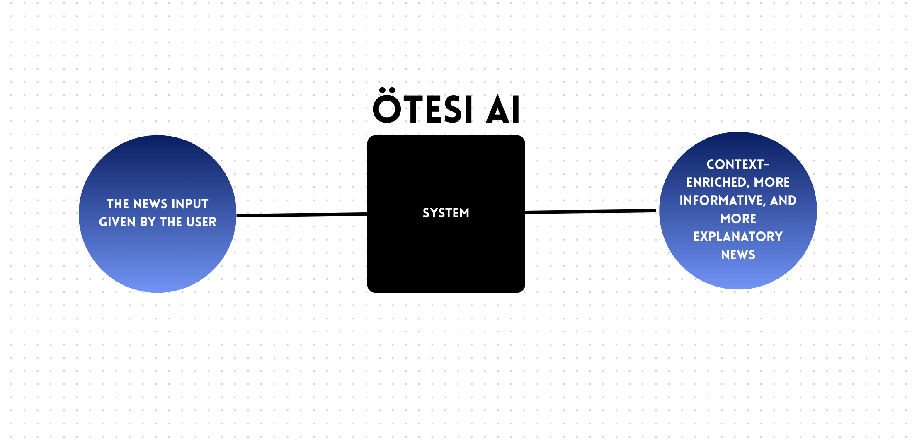

# 🌐 Otesi

**Otesi**, haberleri sadece “flash” olarak değil, **bağlamıyla** birlikte sunmayı amaçlayan bir projedir.  
Kullanıcı bir haber linki girdiğinde, sistem şu sorulara yanıt verir:  
- 📌 Bu haber **neden önemli**?  
- 📖 Bu olayın **arka planı nedir**?

**Geliştirilme Aşaması Devam Etmektedir**

